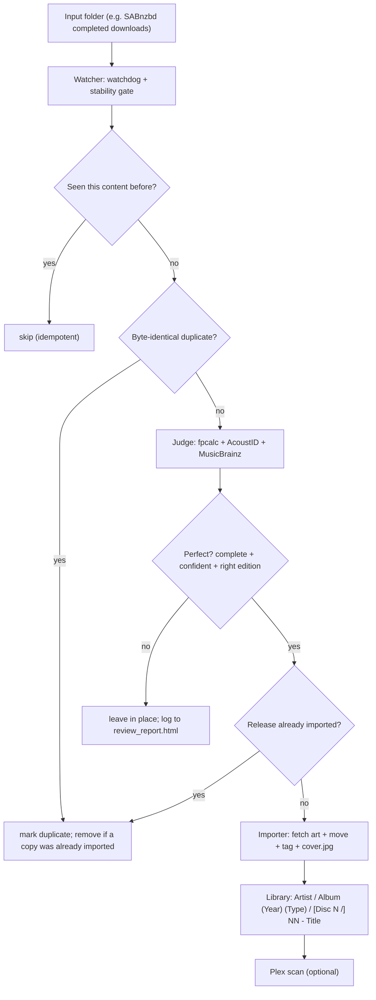

# PicardWatch — Architecture

Automated, Plex-ready music importer for Windows. It watches an input folder,
identifies **complete, high-confidence** albums against MusicBrainz using AcoustID
acoustic fingerprints + existing tags, then **natively** tags and organizes the matched
albums into a Plex-compatible library. Imperfect albums are left untouched and logged.

## Pipeline



## Components

| Module | Responsibility |
|---|---|
| `run.py` | CLI + orchestration. Per-album `process()` with skip/dedupe gates; single-instance lock; modes `--once/--watch/--folder` and flags `--dry-run/--limit/--force`. |
| `picardwatch/config.py` | Load `config.yaml` → dot-namespace; point pyacoustid at the bundled `bin/fpcalc.exe`. |
| `picardwatch/state.py` | SQLite: per-folder decisions, MB/AcoustID response cache, content-signature + release-MBID dedupe queries. |
| `picardwatch/musicbrainz.py` | Rate-limited MB client (1 req/s) + on-disk cache; TLS `ssl_mode`; release helpers (`release_tracks/artist/year/type`). |
| `picardwatch/judge.py` | **The "perfect album" decision.** Fingerprints files, resolves the best MusicBrainz release, scores it, and builds the per-file tag plan. |
| `picardwatch/coverart.py` | Cover Art Archive front-image fetch (urllib, respects `ssl_mode`). |
| `picardwatch/tagger.py` | Write Plex-friendly tags + (optionally) embed art across FLAC / MP3 / M4A / Ogg / Opus. |
| `picardwatch/organizer.py` | Plex-safe destination paths: `Artist/Album (Year) (Type)/[Disc N/]NN - Title.ext`; Windows filename sanitisation. |
| `picardwatch/importer.py` | Native import: fetch art → move each file → tag → write `cover.jpg` → carry extras → delete source. |
| `picardwatch/watcher.py` | watchdog observer + folder-stability gate + periodic rescan backstop. |
| `picardwatch/report.py` | `review_report.html` of imperfect / duplicate albums and why. |
| `picardwatch/verifier.py`, `picard_runner.py` | The **optional** Picard engine (drive Picard in batch + verify the move). Native tagging is the default. |

## The "perfect album" judge

For one album folder:

1. **Enumerate** audio files (by extension).
2. **Analyse each file** (concurrently; results cached by file signature):
   - `fpcalc` acoustic fingerprint → **AcoustID** lookup → candidate *recording* MBIDs (with scores) and the *releases* those recordings belong to;
   - read existing tags (album/artist/title/…) via Mutagen.
3. **Candidate releases** = the most fingerprint-voted releases first; a tag-based MusicBrainz search is used only as a fallback if fingerprints don't already produce a perfect match.
4. **Score each candidate** (stopping at the first perfect one — *early exit*):
   - fetch the release tracklist from MusicBrainz (cached);
   - match each file to a track primarily by **recording-MBID intersection** (AcoustID score ≥ `acoustid.min_score`);
   - files AcoustID can't place fall back to **duration (±tolerance) + fuzzy-title** matching;
   - compute `coverage` (release tracks matched), `orphans` (unmatched files), file-vs-track counts, and the minimum per-track confidence.
5. **PERFECT** iff `coverage == 1.0` **and** `orphans == 0` **and** `file_count == release_track_count` (and a single release was chosen).
6. On a perfect match, emit a **tag plan**: per-file `{title, artist, position, disc, recording_id}` plus album metadata `{album, albumartist, year, type, mbid, release_group_id, is_compilation, total_tracks, total_discs}`.

Anything not perfect is left in place with a human-readable reason (missing N tracks, K unmatched files, wrong edition, etc.).

## Output layout (Plex-compatible)

```
<library>/<Album Artist>/<Album> (Year) (Type)/
    01 - Title.flac                 # single-disc → flat
    02 - Title.flac
    cover.jpg                       # album-level art (Plex reads this)

<library>/Various Artists/<Comp> (Year) (Compilation)/
    01 - Track Artist - Title.flac  # compilations: track artist in the name + TCMP flag

<library>/<Album Artist>/<Album> (Year) (Type)/
    Disc 1/01 - Title.flac          # multi-disc → one subfolder per disc
    Disc 2/01 - Title.flac
    cover.jpg
```

- `(Type)` is the MusicBrainz release type — `Album`, `EP`, `Single`, `Compilation`, `Live`, `Soundtrack`, … (a notable secondary type wins over the primary).
- **Tags written** (Plex reads embedded tags first): Album Artist, Artist, Title, Track #/Total, Disc #/Total, Date + Original Date, Compilation flag for Various-Artists, MusicBrainz album/track IDs, release type. Cover art is always saved as `cover.jpg`; embedding into each file is opt-in (`importer.embed_art`) because it rewrites every file (slow on hi-res FLAC).
- Multi-disc albums are grouped into one album by Plex via the embedded Disc Number tags regardless of the subfolders.

## De-dupe (`importer.dedupe`, default on)

Downloads are frequently re-posted. Two checks:

1. **Content signature (pre-judge):** a sha1 of the folder's sorted `(relative path, size)` pairs. If another folder with the *identical* signature was already handled, the new one is marked `duplicate` without re-fingerprinting. If the original was already **imported**, the redundant copy is removed (it is byte-identical to a library album).
2. **Release MBID (post-judge):** if a perfect album resolves to a release MBID that is already `imported` from another folder, it's left in place and flagged `duplicate` (kept rather than deleted, since it may be a different encoding/quality).

## State & idempotency

SQLite (`state.sqlite3`):
- `albums(folder PK, signature, status, release_mbid, artist, title, score, coverage, orphans, file_count, track_count, reason, decided_at)` — `status ∈ {imported, review, duplicate, failed, would_import}`.
- `cache(k, v, ts)` — MusicBrainz release lookups and per-file AcoustID results.

The **content signature** drives idempotency: an unchanged, already-decided folder is skipped; if its contents change (e.g. you add the missing track), the signature changes and it is re-evaluated. This matters because imperfect albums stay in the input folder.

## Concurrency & throughput

- **Parallel fingerprinting:** cache-miss files are fingerprinted + looked up concurrently (`judge.fingerprint_workers`); all SQLite writes stay on the main thread (the connection is not thread-safe).
- **Early exit:** candidate releases are scored in vote order and scoring stops at the first perfect match — usually one MusicBrainz fetch instead of many.
- **Caching:** fingerprints/AcoustID results and MB releases are cached, so re-runs (and duplicates) are fast and the whole run is resumable.
- **Rate limits:** MusicBrainz is throttled to 1 req/s (enforced by the client); AcoustID is hit at most a few/s. These, plus fingerprint CPU time, set the per-album cost (~seconds for cached, ~tens of seconds for fresh hi-res albums).

## Networking & TLS

- MusicBrainz is queried with `musicbrainzngs` (stdlib `urllib`), which verifies against the **Windows trust store**. Python 3.13+ enables strict X.509 checks by default, which reject the non-RFC-strict CA certs that antivirus/proxy HTTPS-scanning injects. `musicbrainz.ssl_mode: relaxed` clears just that strict flag (still verifying chain + hostname). `strict` and `none` are also available.
- Cover Art Archive is fetched via `urllib`, so it inherits the same relaxed context.
- AcoustID is reached over plain HTTP by `pyacoustid`, so it is unaffected by HTTPS interception.

## Safety & failure handling

- **Imperfect albums are never modified** — only complete, confident matches move.
- **Move-then-tag:** files are moved first, then tagged; a tagging error logs and continues (a moved file is never lost to a tag failure).
- **Source deletion** happens only after *all* of an album's tracks are verified moved (`importer.delete_source`).
- **Single-instance lock** (OS file lock) prevents two `--once/--watch` runs (e.g. a manual run and the autostart task) from clobbering each other or the DB.
- **Per-album isolation:** in `--once`, an exception on one folder is logged and the run continues.

## Operational modes

| Command | Behaviour |
|---|---|
| `run.py --folder "<path>"` | Process one album and exit (add `--force` to re-judge, `--dry-run` to preview). |
| `run.py --once [--limit N]` | Scan all album folders once (optionally the first N) and exit. |
| `run.py --watch` | Startup scan = process the whole backlog, then watch the input folder for new arrivals indefinitely. |
| `--dry-run` | Judge + report only; never move/modify files. |

`install.ps1` provisions the venv, dependencies, `bin/fpcalc.exe`, `config.yaml`, and an optional **logon autostart task** that runs `run.py --watch` so the watcher survives reboots. Because tagging is native (no Picard GUI), the watcher runs headless; it runs in the user's logon session so a mapped input drive (e.g. `Y:`) is available.
